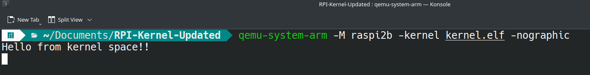
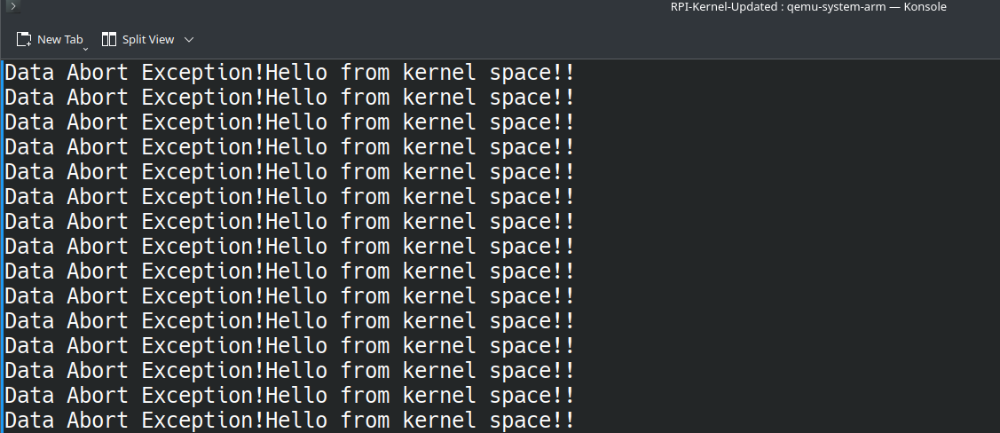
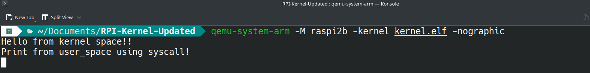
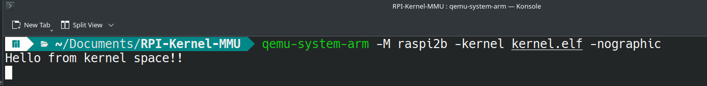

# Raspberry Pi 2B Kernel - Bare Metal

Bare Metal implementation of raspi2b.

(For Task 1 and 2, I have disabled MMU)

Overall directory stucture of the project:
```
├── kernel
│   ├── headers
│   │   ├── exceptions
│   │   │   └── exception_handlers.h
│   │   ├── io.h
│   │   ├── mmu.h
│   │   ├── peripherals
│   │   │   └── uart.h
│   │   └── syscalls
│   │       └── syscalls.h
│   ├── kernel.c
│   └── src
│       ├── exceptions
│       │   ├── exception_handlers.c
│       │   └── exceptions.S
│       ├── io.c
│       ├── mmu.c
│       ├── peripherals
│       │   └── uart.c
│       └── syscalls
│           └── syscalls.c
├── linker.ld
├── Makefile
├── start.S
└── user_space
    └── user.c
```

## Task 1: UART-Based Serial Output in EL

- Operate entirely in EL1 (privileged mode)

By default it boots in svc (privileged) mode. 
But still I have added this in start.S to make sure it runs in svc mode

```
mrs r0, cpsr
bic r1, r0, #0x1F
orr r1, r1, #0x13
msr cpsr_c, r1

```

- Send the string "Hello World" to the serial monitor using the UART0 peripheral via memory-mapped I/O

```
void kmain (void) {

    uart_init();
    uart_flush_rx();

    printk("Hello from kernel space!!\n");

    while(1) {}

}
```

As you can see "Hello World!" is printed in serial monitor (using UART)



- Define and use a custom printf() function to output the message, without relying on any standard library UART APIs.

I have implemented my custom print function `printk()`

## Task 2: Restrict UART Access from EL0

- Switch from EL1 to EL0 (user mode) after system initialization

This code is called in kernel_main function, which switches from svc to user mode. It branches to user_main function.

```
void switch_to_user_mode (void){
    __asm__ volatile (
    "mrs r0, cpsr\n\t"
    "bic r0, r0, #0x1F\n\t"
    "orr r0, r0, #0x10\n\t"
    "msr cpsr_c, r0\n\t"
    "blx umain\n\t"
    );

}

```
- Ensure that direct access to the UART peripheral is disallowed from EL0. Attempts to call printf() from EL0 should result in a controlled failure or exception

Yes it triggers Data Abort Exception when we try to call `printk()` in umain()

```
void umain() {
    printk("It should not print this and instead triggers exception");

}

```
Here the exception is not exiting properly, that is why it is looping indefinitely (Have to FIX it!)



- Implement an appropriate privileged mechanism (e.g., SVC/syscall) to allow user-mode programs to request UART output indirectly.

So I have implemented syscall_printk function (syscall_write to stdout).

```
(user.c)

#include "syscalls/syscalls.h"

void umain() {

    syscall_printk("Print from user_space using syscall!\n");

}

```



## Bonus Task: Virtual Memory and User Program Execution

So for now I have set up identity mapping for both kernel and user space.
But for some reason user code is not working.
I tried isolating user and kernel space but only kernel code works.

- Virtual memory using the ARMv7-a MMU. Creation of page tables that separate the kernel and user memory spaces.

I have called `mmu_init()` function in start.S before calling `kmain()`

```
// MMU init
ldr r3, =mmu_init
blx r3

// Call kernel_main
ldr r3,=kmain
blx r3
```

You can check out mmu.c for how it is implemented



As you can see kernel code works fine, but user code does not run
